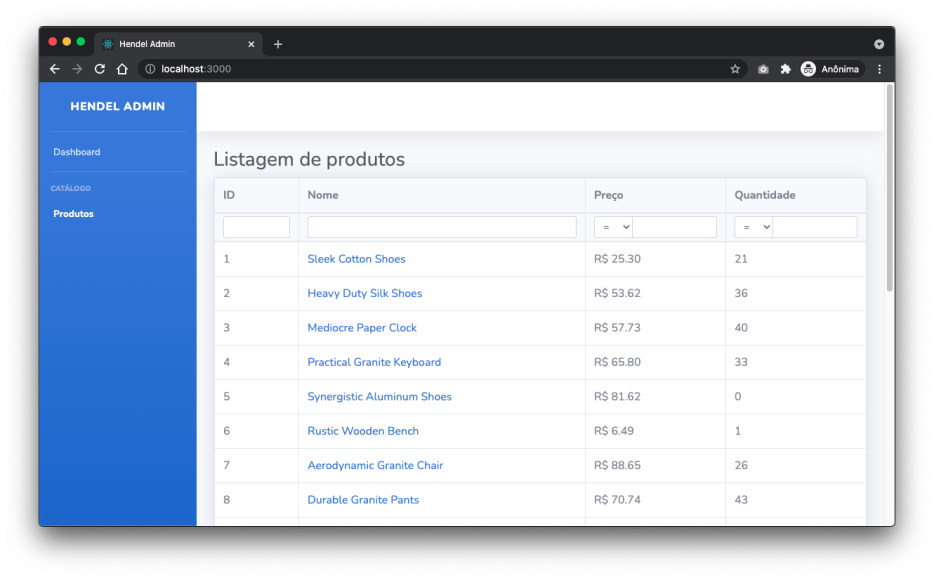

# Mini Projeto Vaga Fullstack

O objetivo deste mini projeto é implementar tarefas adicionais ao admin deste repositório, que consiste em gerenciar o catálogo de produtos de um e-commerce.

Este repositório contem dois projetos, um na pasta `backend`, que é um api em rails, e outro na pasta `frontend`, criado em react com typescript.

As tarefas devem ser implementadas no back e no frontend.



### Tarefas:
1. Adicionar paginação a listagem de produtos 
2. Permitir filtra a listagem de produtos com base nos campos de busca disponíveis
3. Exibir todas as informações do produto na página de Detalhes do produto
4. Exibir um "loading" no carregamento das páginas
5. Previnir requisições duplicadas ao adicionar ou remover um produto relacionado. Ex: O usuário clica de enviar um formulário e antes da requisição terminar ele clica novamente.
6. Extra:
    - Permitir adicionar e remover Produtos relacionados na página de detalhes do produto. ([seguir seguir o seguinte padrão na api](#api-produtos-relacionados))

Observações:
> Usar query params na url para manter o estado da paginação e dos filtros após reload da página

> Os elementos do front são baseados no seguinte template: https://startbootstrap.com/previews/sb-admin-2

> Após finalizado o teste, o candidato deverá subir o projeto em seu github e nos enviar o link

## Setup

### Backend

Requisitos:
  - Ruby 3.0.2
  - Postgresql

```bash
cd backend

bundle install && rails db:create db:migrate db:seed

RAILS_ENV=test rails db:migrate
```

### Frontend

Requisitos:
  - Node
  - Yarn

```bash
cd frontend
yarn install
```

## Iniciando projeto

### Backend
```bash
cd backend
rails server -p 3000
```

### Frontend
```bash
cd frontend

PORT=3001 yarn start
```

Documentação do que já está pronto na API:

## API Documentation
- Product
  - [list](#list-products)
  - [get details](#get-product-details)
  - [create](#create-a-product)
  - [update](#update-a-product)
  - [delete](#delete-a-product)

### List Products
```
GET /products
```

`Response status: 200`
```json
[
  {
    "id": 1,
    "name": "Product test",
    "description": "Description of product test",
    "price": "10.99",
    "quantity": 50,
    "created_at": "2021-07-05T23:13:17.383Z",
    "created_at": "2021-07-05T23:13:17.383Z"
  }
]
```

### Get Product details
```
GET /products/:id
```

`Response status: 200`

```json
{
  "id": 1,
  "name": "Product test",
  "description": "Description of product test",
  "price": "10.99",
  "quantity": 50,
  "created_at": "2021-07-05T23:13:17.383Z",
  "created_at": "2021-07-05T23:13:17.383Z"
}
```

`Response status: 404`
```json
{
  "errors": ["Couldn't find Product with 'id'=22"]
}
```

### Create a Product
```
POST /products
```

`Body`
```json
{
  "name": "Product test",
  "description": "Description of product test",
  "price": "10.99",
  "quantity": 50,
}
```

`Response status: 201`
```json
{
  "id": 1,
  "name": "Product test",
  "description": "Description of product test",
  "price": "10.99",
  "quantity": 50,
  "created_at": "2021-07-05T23:13:17.383Z",
  "created_at": "2021-07-05T23:13:17.383Z"
}
```

`Response status: 422`
```json
{
  "errors": ["Name has already been taken"]
}
```

### Update a Product
```
PUT/PATCH /products
```

`Body`
```json
{
  "description": "NEW Description of product test",
}
```

`Response status: 201`
```json
{
  "id": 1,
  "name": "Product test",
  "description": "NEW Description of product test",
  "price": "10.99",
  "quantity": 50,
  "created_at": "2021-07-05T23:13:17.383Z",
  "created_at": "2021-07-05T23:13:17.383Z"
}
```

`Response status: 422`
```json
{
  "errors": ["Description can't be blank"]
}
```

### Delete a Product

```
DELETE /products/:id
```

`Response status: 204`
```json
null
```

`Response status: 404`
```json
{
  "errors": ["Couldn't find Product with 'id'=22"]
}
```

## API Produtos relacionados
`A FAZER`

  - [add related product](#add-related-product)
  - [remove related product](#remove-related-product)

### Add Related Product
```
POST /products/:product_id/related_products
```

`Body`
```json
{
  "related_product_id": 22
}
```

`Response status: 201`
```json
{
  "id": 22,
  "name": "Product test",
  "price": "10.99",
  "main_product_id": 1
}
```

`Response status: 404|422`

```json
{
  "errors": ["Mensagem de erro"]
}
```

### Remove Related Product

```
DELETE /products/:product_id/related_products/:related_product_id
```

`Response status: 204`
```json
null
```

`Response status: 404`

```json
{
  "errors": ["Mensagem de erro"]
}
```